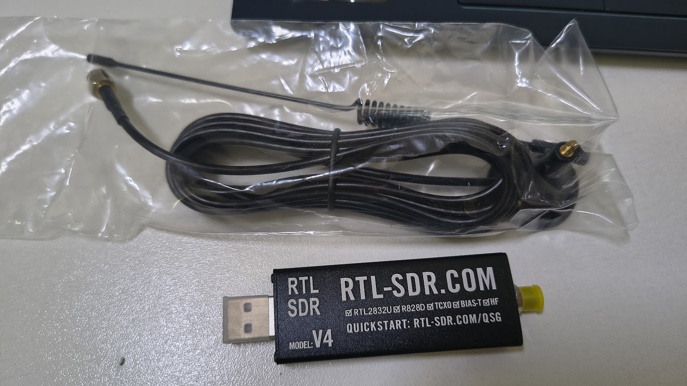
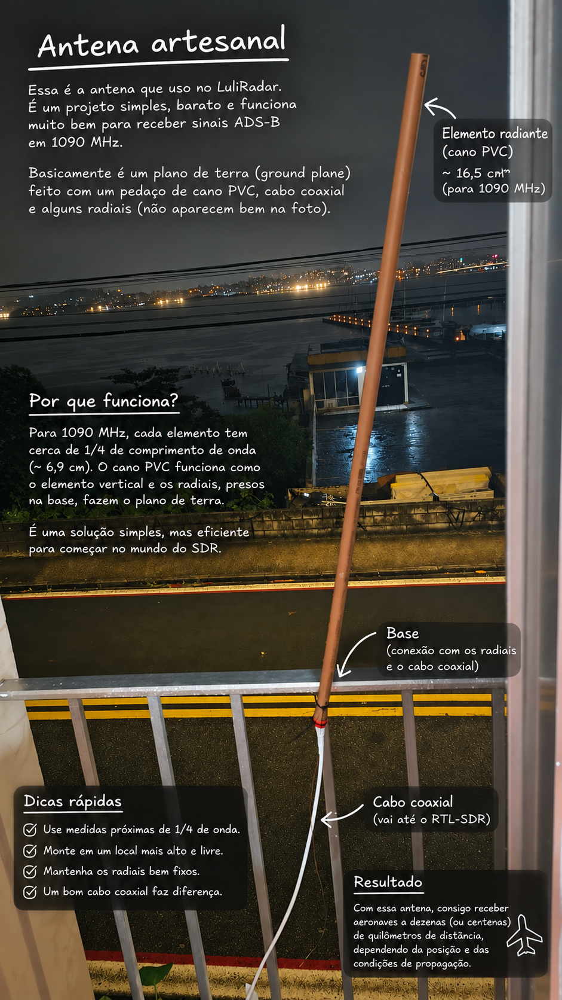
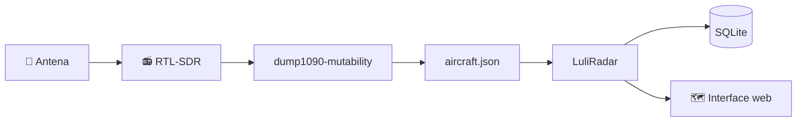
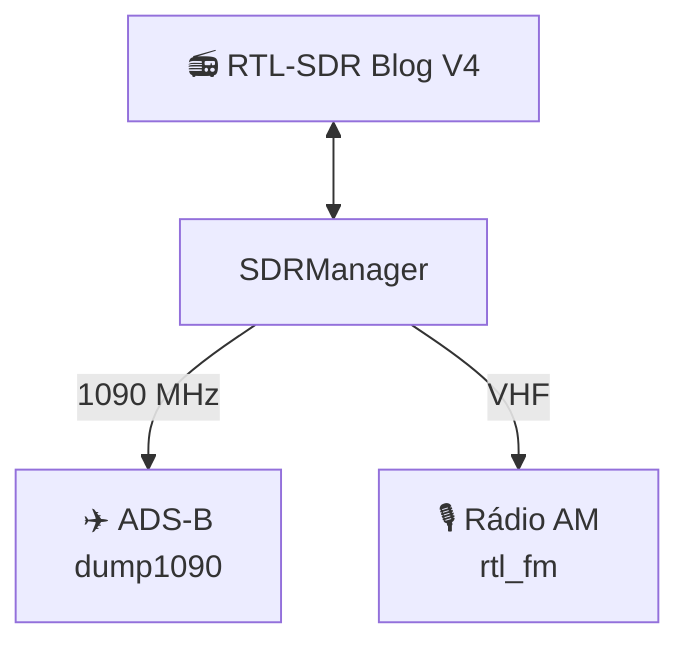

# 📡 LuliRadar

> Aviões, rádio, sinais atravessando o céu — e um RTL-SDR fazendo coisa demais.

O **LuliRadar** é minha estação pessoal de monitoramento aeronáutico construída em volta de um **RTL-SDR Blog V4**.

A ideia começou simples: receber **ADS-B em 1090 MHz** e enxergar os aviões que estavam realmente passando pelo alcance da minha antena.

Naturalmente, saiu do controle.

Hoje o projeto também experimenta usar o mesmo dongle como receptor de **rádio aeronáutico VHF em AM**, com controle de frequências, detecção de sinal, gravação de transmissões e a ideia futura de cruzar tudo isso com o histórico ADS-B.

Tudo localmente.

Sem depender de FlightRadar para dizer o que **meu próprio rádio** está recebendo.

Só antena, RF, alguns programas clássicos do ecossistema SDR e código.

---

## 📻 O rádio

<p align="center">
  
</p>

No centro do projeto está um **RTL-SDR Blog V4**.

Dispositivos RTL-SDR transformaram hardware originalmente relacionado à recepção de TV digital em receptores de rádio definidos por software capazes de explorar uma faixa enorme do espectro.

No LuliRadar, um único dongle atualmente tem duas vidas:

**✈️ ADS-B — 1090 MHz**  
Recebe as transmissões digitais enviadas pelas aeronaves.

**🎙️ Rádio aeronáutico — VHF AM**  
Permite experimentar com frequências como Torre, Solo e ATIS.

O problema divertido é que ele continua sendo **um único rádio**.

Ele não pode estar em 1090 MHz e 118.700 MHz ao mesmo tempo.

Então o software precisa decidir quem fica com o SDR.

---

## 🛸 A estação

E um rádio sem antena não escuta muita coisa.

<p align="center">
  
</p>

Parte da graça do SDR é justamente experimentar também com o lado físico da coisa: antenas simples, cabo coaxial, conectores, posição, comprimento dos elementos e descobrir até onde um receptor USB consegue enxergar.

Uma antena artesanal ajustada para a frequência desejada já é suficiente para começar a receber sinais que estavam literalmente atravessando o ar o tempo inteiro.

Só faltava alguma coisa para escutá-los.

---

# ✈️ ADS-B

No modo ADS-B, o RTL-SDR é entregue ao `dump1090-mutability`, responsável pela recepção e decodificação das mensagens transmitidas pelas aeronaves em **1090 MHz**.

O LuliRadar acompanha os dados produzidos pelo decoder e constrói sua própria visão do espaço aéreo recebido pela estação.

<p align="center">
  
</p>

Atualmente é possível acompanhar:

- aeronaves dentro do alcance;
- posição no mapa;
- ICAO;
- callsign;
- altitude;
- velocidade;
- rumo;
- taxa vertical;
- distância até o receptor;
- tempo desde a última mensagem;
- trilha recente;
- histórico de passagens;
- sessões de voo armazenadas em SQLite.

O sistema também faz uma classificação simples do comportamento observado:

- provável subida;
- provável descida;
- provável cruzeiro;
- baixa altitude;
- aproximando-se do receptor;
- afastando-se do receptor.

Esses estados são **inferências feitas pelo LuliRadar**, e não informações oficiais de fase de voo.

---

## 🗺️ Do sinal até o mapa

O LuliRadar não tenta reinventar um decoder ADS-B.

Essa parte já é muito bem resolvida pelo `dump1090`.

A aplicação entra depois:



O `dump1090-mutability` recebe e decodifica.

O LuliRadar cuida de:

**ingerir → normalizar → interpretar → armazenar → apresentar**

Os dados atuais ficam em memória para resposta rápida da API, enquanto informações úteis para histórico são persistidas em SQLite.

---

# 🎙️ Rádio aeronáutico — experimental

> ⚠️ **Esta parte ainda está em desenvolvimento.**
>
> A recepção de áudio pelo LuliRadar já funciona, assim como o controle do
> `rtl_fm`, medição de nível e a estrutura para gravação automática.
> **Mas a experiência de escuta ainda está meio bugada e não está tão boa
> quanto eu quero.**
>
> Se a intenção agora é simplesmente sintonizar e ouvir rádio aeronáutico,
> **use o SDR++ — atualmente ele faz isso muito melhor. 😅**
>
> O objetivo do LuliRadar aqui não é substituir o SDR++, mas evoluir essa
> parte até integrá-la de forma interessante com o restante da estação:
> gravações, histórico, ADS-B e correlação temporal entre sinais.

O segundo modo do projeto entrega o dongle ao `rtl_fm`.

Em vez de decodificar pacotes ADS-B, agora estamos experimentando com a recepção de **rádio aeronáutico VHF em AM**.

<p align="center">
  
</p>

A interface já permite selecionar frequências, ajustar parâmetros e acompanhar o nível recebido.

O backend também possui a lógica para detectar atividade acima do squelch e registrar transmissões em WAV.

Essa parte, porém, ainda é **laboratório**.

A ideia é melhorar a recepção, acertar a experiência de escuta e então explorar o que realmente torna esse modo interessante dentro do LuliRadar: usar as transmissões recebidas junto com os dados que a própria estação capturou via ADS-B.

---

## 🔴 Para onde vai o modo rádio

A arquitetura para gravação automática já existe.

O áudio PCM produzido pelo `rtl_fm` passa pelo backend, que calcula o nível RMS/dBFS e usa um squelch para identificar períodos de atividade.

A partir disso, o sistema consegue criar gravações WAV e associá-las a horário, frequência e preset.

Há também um **pré-buffer circular**, pensado para evitar que o começo de uma transmissão seja perdido.

**Ainda estou acertando essa parte na prática.**

A meta não é construir mais um SDR++.

A meta é chegar nisto:

```text
118.700 MHz
14:32:08
│
├── 🎙️ transmissão recebida
├── 🔊 gravação
│
└── ✈️ aeronaves que estavam na região naquele instante
      ├── AZU1234
      ├── GLO5678
      └── ...
```

É aí que rádio e ADS-B deixam de ser duas experiências separadas e começam a virar uma estação só.

---

## 🎚️ Frequências

As frequências ficam fora do código, em:

```text
config/frequencies.json
```

A configuração atual inclui:

| Canal | Frequência |
|---|---:|
| Torre Florianópolis | 118.700 MHz |
| Emergência / Guard | 121.500 MHz |
| Solo Florianópolis | 121.700 MHz |
| Operações Florianópolis | 122.500 MHz |
| Torre MIL | 122.800 MHz |
| ATIS Florianópolis | 127.450 MHz |

Isso significa que a aplicação não precisa ficar presa a Florianópolis.

Troque o arquivo de frequências e a estação pode ganhar presets de outro lugar.

Também é possível sintonizar uma frequência manualmente.

---

# 🧠 Um dongle, dois mundos

Aqui apareceu um problema interessante de software causado por uma limitação física.

Só existe **um RTL-SDR**.

ADS-B e rádio não podem simplesmente abrir o dispositivo ao mesmo tempo.

Por isso existe um componente central chamado `SDRManager`.



Ele mantém uma pequena máquina de estados:

```text
          ┌───────────┐
          │   IDLE    │
          └─────┬─────┘
                │
                ▼
        ┌───────────────┐
        │   SWITCHING   │
        └──────┬─┬──────┘
               │ │
          ┌────┘ └────┐
          ▼           ▼
      ┌──────┐    ┌───────┐
      │ ADSB │    │ RADIO │
      └──────┘    └───────┘
```

Antes de entregar o SDR para outro modo, o processo atual precisa ser encerrado e o dispositivo USB realmente liberado.

Só então o próximo processo é iniciado.

O backend ainda espera alguns instantes para confirmar que o novo processo não morreu imediatamente por coisas como:

```text
device busy
```

Se duas requisições tentarem trocar o rádio simultaneamente, uma delas é rejeitada em vez de deixar dois processos disputarem o hardware.

Essa parte acabou sendo uma das coisas mais interessantes do projeto.

**O software precisa respeitar o rádio.**

---

# 🕰️ Memória da estação

Eu não queria apenas saber:

> “quais aviões estou vendo agora?”

Quero conseguir olhar para trás.

Por isso o LuliRadar mantém um banco SQLite com informações como:

- aeronaves conhecidas;
- sessões de voo;
- posições recebidas;
- horários;
- distâncias;
- estatísticas ADS-B;
- transmissões de rádio;
- gravações.

As posições não são simplesmente despejadas no banco a cada atualização.

Existe throttling para evitar armazenar milhares de pontos praticamente idênticos.

A ideia é construir aos poucos uma **memória local do que minha própria estação recebeu**.

---

# 🔬 E agora começa a parte realmente divertida

ADS-B e rádio hoje são dois modos diferentes.

Mas eles têm algo em comum:

**tempo.**

O LuliRadar sabe aproximadamente:

> qual aeronave estava onde em determinado instante

e também pode registrar:

> em qual frequência houve uma transmissão naquele instante.

Isso abre uma possibilidade que quero explorar bastante.

```text
14:32:08
│
├── 📻 transmissão recebida em 118.700 MHz
│
└── ✈️ aeronaves observadas naquele momento
      ├── AZU1234
      ├── GLO5678
      └── ...
```

Isso **não significa que seja possível afirmar automaticamente quem falou**.

Mas significa que os dois conjuntos de dados podem começar a conversar.

E é justamente essa interseção entre **RF + dados + software** que eu quero explorar com o projeto.

---

## 🔭 Ideias para as próximas versões

Algumas coisas que quero experimentar:

- melhorar e estabilizar a recepção do modo rádio;
- melhorar a reprodução de áudio;
- acertar squelch e detecção automática de transmissões;
- correlacionar transmissões com aeronaves observadas naquele instante;
- mostrar quais aeronaves estavam próximas durante uma gravação;
- reproduzir gravações diretamente pelo histórico;
- transcrever comunicações gravadas;
- pesquisar transmissões por frequência e horário;
- melhorar a classificação de subida/descida;
- detectar possíveis aproximações;
- adicionar conhecimento sobre aeroportos e pistas;
- visualizar aproximações e decolagens no histórico;
- gerar estatísticas da estação;
- medir alcance máximo por direção;
- construir mapas de cobertura;
- identificar horários de maior atividade;
- explorar outras frequências;
- explorar outros modos de recepção;
- experimentar outras antenas.

E provavelmente inventar mais coisa conforme sinais interessantes aparecerem.

---

# 📡 Porque SDR é irado

Essa talvez seja a verdadeira razão de o projeto existir.

Um RTL-SDR é um negócio relativamente pequeno conectado numa USB.

Uma antena pode ser literalmente construída na bancada com cabo, conectores e pedaços de metal.

E de repente aparecem:

```text
aviões
torres
ATIS
telemetria
rádio
satélites
AIS
sensores
balões
radioamadores
e um monte de coisa que eu ainda nem fui procurar
```

Esses sinais já estavam ali.

Atravessando minha casa.

Atravessando a cidade.

Atravessando o computador onde estou escrevendo esse README.

O SDR só permite que eu finalmente enxergue alguns deles.

E aí obviamente eu quero escrever software em cima.

---

# 🛠️ Stack

O LuliRadar tenta continuar relativamente simples.

### Aplicação

- Python
- Flask
- SQLite
- JavaScript
- HTML
- CSS

### Rádio

- RTL-SDR Blog V4
- `rtl_fm`
- `dump1090-mutability`
- `aplay`

### E só.

Sem React.

Sem Redis.

Sem microsserviços.

Sem necessidade de colocar uma estação de rádio doméstica dentro de um cluster Kubernetes.

---

# 🚀 Rodando o LuliRadar

O projeto foi desenvolvido para Linux.

## Dependências do sistema

Em Debian/Ubuntu/Pop!_OS:

```bash
sudo apt update
sudo apt install python3-venv python3-pip rtl-sdr dump1090-mutability alsa-utils
```

O `dump1090-mutability` instalado pelo sistema pode iniciar automaticamente e tomar posse do RTL-SDR.

Como o próprio LuliRadar controla quando o decoder deve rodar, desative o serviço:

```bash
sudo systemctl disable --now dump1090-mutability
```

---

## Clone

```bash
git clone https://github.com/lulinucs/LuliRadar-ADS-B-aircraft-tracker-with-RTL-SDR.git
cd LuliRadar-ADS-B-aircraft-tracker-with-RTL-SDR
```

---

## Ambiente Python

```bash
python3 -m venv .venv
source .venv/bin/activate
pip install -r requirements.txt
```

---

## Configuração

Copie o exemplo:

```bash
cp .env.example .env
```

Configure pelo menos a posição da estação:

```env
RECEIVER_LAT=
RECEIVER_LON=
RECEIVER_LABEL=Minha estação
```

A posição é usada para calcular a distância entre o receptor e as aeronaves recebidas.

Outros parâmetros permitem ajustar comportamento do ADS-B, rádio, squelch, ganho, gravações e caminhos dos binários.

---

## Executando

```bash
python3 run.py
```

Depois abra:

```text
http://127.0.0.1:5000
```

Pressione `Ctrl+C` para encerrar.

O LuliRadar tenta finalizar os processos associados ao SDR e liberar o dongle de forma limpa.

---

# 🧪 Testes

Boa parte da aplicação pode ser testada sem colocar a mão no SDR real.

```bash
python3 -m unittest discover -s tests -v
node tests/test_frontend_format.mjs
```

Os testes usam processos simulados para validar partes como:

- troca de modos;
- concorrência;
- parâmetros do rádio;
- rotas HTTP;
- formatação do frontend;
- comportamento do `SDRManager`.

Isso é particularmente útil porque:

> “os testes passaram, mas preciso de um avião sobrevoando minha casa”

não seria uma estratégia de CI muito prática.

---

# 📂 Estrutura

```text
LuliRadar/
│
├── app/
│   ├── adsb_service.py
│   ├── radio_service.py
│   ├── sdr_manager.py
│   ├── database.py
│   ├── models.py
│   ├── state_classifier.py
│   ├── distance.py
│   ├── routes.py
│   └── config.py
│
├── config/
│   └── frequencies.json
│
├── imgs/
│   ├── Captura de tela de 2026-09-21 22-30-29.png
│   ├── Captura de tela de 2026-09-21 22-31-10.png
│   ├── rtl-sdr-v4.jpg
│   └── antena-artesanal.jpg
│
├── static/
├── templates/
├── tests/
│
├── run.py
├── requirements.txt
├── .env.example
└── README.md
```

Dados produzidos durante o uso ficam fora do Git:

```text
data/
recordings/
.env
```

---

# 🛰️ O que este projeto não é

O LuliRadar não pretende substituir:

- FlightRadar24;
- ADS-B Exchange;
- SDR++;
- scanners profissionais;
- softwares especializados de controle de tráfego aéreo.

Eles resolvem problemas diferentes.

Especialmente no caso do **SDR++**: se você quer simplesmente explorar o espectro e ouvir rádio agora, **use ele**.

O modo rádio do LuliRadar ainda é experimental.

Esse projeto é uma **estação pessoal de experimentação**.

Eu quero acompanhar o caminho inteiro:

```text
sinal no ar
    ↓
antena
    ↓
RTL-SDR
    ↓
decoder / demodulador
    ↓
Python
    ↓
dados
    ↓
histórico
    ↓
interface
    ↓
"caralho, tem um avião passando ali"
```

É uma desculpa para aprender rádio fazendo software.

E uma desculpa para fazer software brincando com rádio.

---

# 📻 LuliRadar

**O céu está transmitindo um monte de coisa.**

Eu só coloquei uma antena para ouvir.